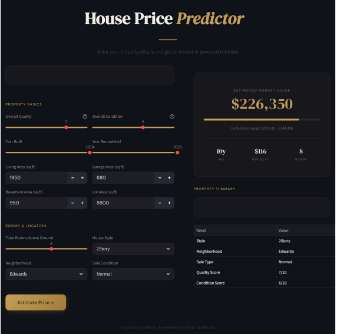

# 🏡 House Price Prediction

A machine learning web application that predicts residential house prices using the **Ames Housing Dataset**. The model is trained with XGBoost and served through an interactive **Streamlit** UI.

---

## 📌 Project Overview

This project walks through a complete ML pipeline — from data exploration and feature engineering to model training, evaluation, and deployment as a web app. Three regression models are compared, and the best-performing one (XGBoost) is saved and used for live predictions.

---

## Project Output



## 🗂️ Project Structure

```
House Price Prediction/
│
├── app/
│   ├── app1.py                  # Simple Streamlit app (basic UI)
│   └── app2.py                  # Styled Streamlit app (production UI)
│
├── data/
│   ├── train.csv                # Training data (Ames Housing Dataset)
│   ├── test.csv                 # Test data for predictions
│   └── prediction.csv           # Model output predictions
│
├── model/
│   └── house_price_model.pkl    # Saved XGBoost pipeline (joblib)
│
├── notebook/
│   └── house_price_analysis.ipynb  # Full EDA + model training notebook
│
└── requirement.txt              # Python dependencies
```

---

## ⚙️ Features Used

| Type | Features |
|------|----------|
| **Numeric** | `LotArea`, `OverallQual`, `OverallCond`, `TotalBsmtSF`, `TotRmsAbvGrd`, `GarageArea`, `GrLivArea`, `YearBuilt`, `YearRemodAdd` |
| **Categorical** | `Neighborhood`, `HouseStyle`, `SaleCondition` |

---

## 🤖 Models Trained

| Model | Description |
|-------|-------------|
| Linear Regression | Baseline model |
| Random Forest | Ensemble of 100 trees, max depth 10 |
| **XGBoost** ✅ | 500 estimators, lr=0.05, max_depth=4 — **best performer** |

All models are wrapped in a **scikit-learn Pipeline** with:
- `SimpleImputer` (median for numeric, most frequent for categorical)
- `StandardScaler` for numeric features
- `OneHotEncoder` for categorical features

The target variable (`SalePrice`) is log-transformed using `np.log1p` during training and back-transformed with `np.expm1` at prediction time.

---

## 🚀 Getting Started

### 1. Clone the repository

```bash
git clone https://github.com/my-username/house-price-prediction.git
cd house-price-prediction
```

### 2. Install dependencies

```bash
pip install -r requirement.txt
```

### 3. Run the app

**Simple UI:**
```bash
cd app
streamlit run app1.py
```

**Styled UI (recommended):**
```bash
cd app
streamlit run app2.py
```

---

## 🖥️ App Preview

The app lets you input property details (living area, year built, neighborhood, etc.) and instantly get an **estimated market value** along with a confidence range and per-square-foot breakdown.

---

## 📊 Notebook

The Jupyter notebook (`notebook/house_price_analysis.ipynb`) covers:

1. **Data Loading** — train/test split from the Ames Housing Dataset
2. **Feature Selection** — choosing the most impactful numeric and categorical columns
3. **EDA** — correlation heatmap, SalePrice distribution, scatter plots
4. **Log Transformation** — normalizing the skewed target variable
5. **Pipeline Building** — imputation, scaling, encoding
6. **Model Training & Cross-Validation** — Linear Regression, Random Forest, XGBoost
7. **Model Evaluation** — RMSE and R² comparison across models
8. **Feature Importance** — top 10 XGBoost feature importances
9. **Prediction Export** — saving results to `data/prediction.csv`
10. **Model Saving** — exporting the final pipeline with `joblib`

---

## 🛠️ Tech Stack

- **Python 3**
- **pandas**, **numpy** — data manipulation
- **matplotlib**, **seaborn** — data visualization
- **scikit-learn** — preprocessing & model pipelines
- **XGBoost** — gradient boosting model
- **joblib** — model serialization
- **Streamlit** — web app framework

---

## 📁 Dataset

The project uses the [Ames Housing Dataset](https://www.kaggle.com/competitions/house-prices-advanced-regression-techniques/data), a popular regression benchmark with 79 features describing residential properties in Ames, Iowa.

---

## 📄 License

This project is open source and available under the [MIT License](LICENSE).
